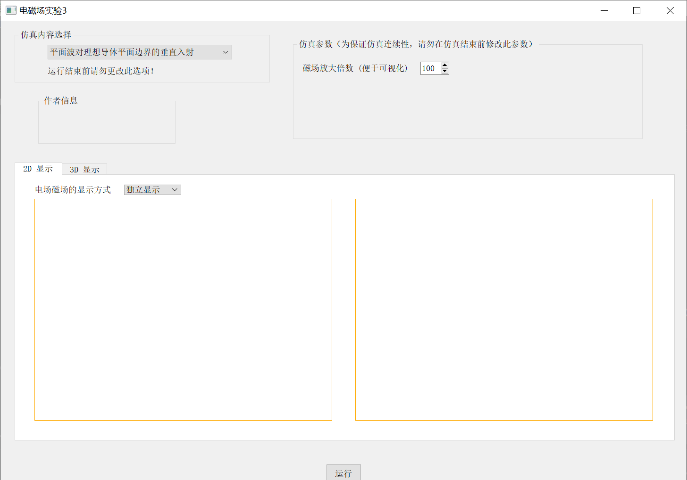
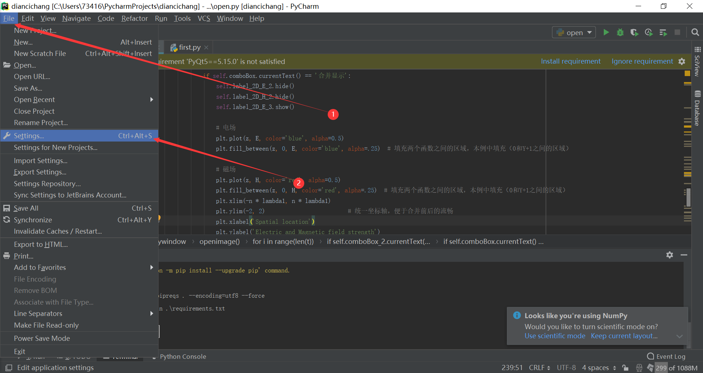
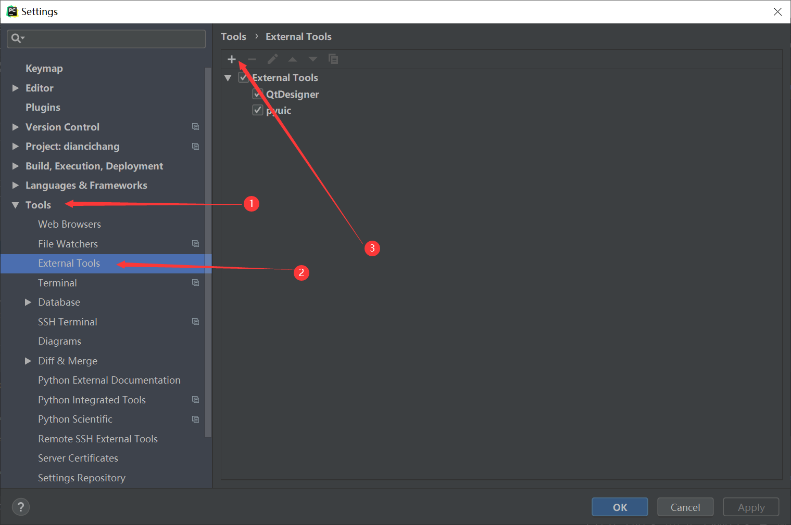
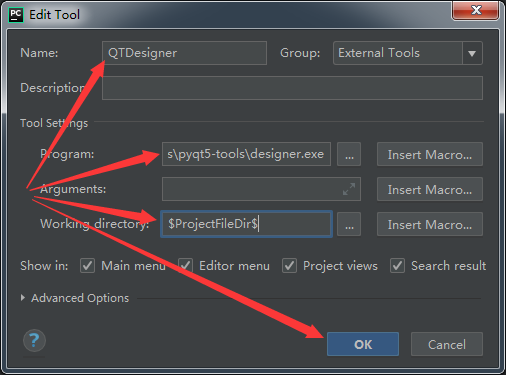
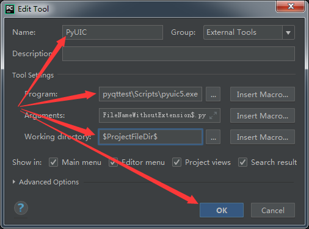
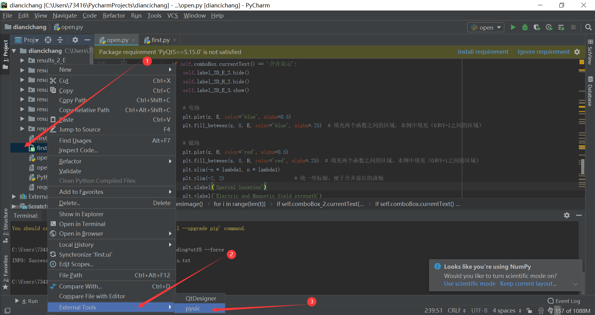

# [Python+GUI] Propagation of electromagnetic field in ideal medium and ideal conductor



### Get start:

#### Environment configuration

```
pip install -r requirements.txt
```

#### Add external tools

##### Qt Designer








- Name: QtDesigner

- Program--designer.exe, located in *Lib\site-packages\pyqt5-tools\designer.exe*

- Working directory--designer.exe 's working dirctory, set to `$ProjectFileDir$`

#####  pyuic



- name: PyUIC

- Program: Scripts\pyuic5.exe

- Arguments: `$FileName$ -o $FileNameWithoutExtension$.py`

- Working dirctory: `$ProjectFileDir$`

#### Run!

##### Compile ui file



##### Run open.py 

Here we are.


